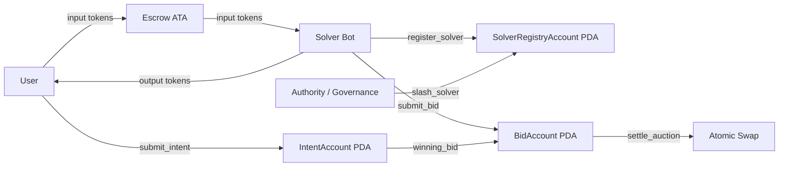

# Flint — On-Chain Intent Auction Protocol

## What is Flint?

Flint is a Solana program for intent-based token swaps. A user submits an intent with locked input tokens and a minimum acceptable output, solvers compete during a short auction window, and the winning bid settles atomically so the user receives output tokens while the solver receives the escrowed input tokens in the same on-chain flow.

## Why Solana?

Solana's roughly 400ms slot times make short-lived on-chain auctions practical. Flint uses a 5-slot auction window, which keeps solver competition close to real time and avoids the latency profile that makes the same design awkward on slower L1s.

## Architecture



## Account Structures

| Account | Fields |
| --- | --- |
| `IntentAccount` | `user`, `input_mint`, `output_mint`, `input_amount`, `min_output_amount`, `open_at_slot`, `close_at_slot`, `best_bid_amount`, `winning_bid`, `status`, `nonce`, `bump` |
| `BidAccount` | `solver`, `intent`, `output_amount`, `submitted_at_slot`, `is_settled`, `bump` |
| `SolverRegistryAccount` | `solver`, `stake_amount`, `total_bids`, `total_fills`, `reputation_score`, `registered_at_slot`, `bump` |

## Instructions

| Instruction | Description | Caller |
| --- | --- | --- |
| `submit_intent` | Locks user input tokens in escrow and opens a 5-slot auction | User |
| `submit_bid` | Places a solver bid and updates the current best bid | Solver |
| `settle_auction` | Settles the winning auction atomically: escrow to solver, solver output to user | Solver bot / anyone |
| `register_solver` | Creates a solver registry PDA and escrows the minimum stake in lamports | Solver |
| `cancel_intent` | Refunds the user after the auction window closes with no bids | User |
| `slash_solver` | Slashes 20% of a registered solver stake after failed fulfillment | Authority / governance |

## Program ID

- Devnet: pending deployment funding; configured program keypair resolves to `5ZBavnDgcW1wnhKEiGp8KbQSHq4PcdVVosUcEX1m4bFt`
- Localnet: `5ZBavnDgcW1wnhKEiGp8KbQSHq4PcdVVosUcEX1m4bFt`

## Build & Test

```bash
export PATH="/Users/blanco/.cargo/bin:$PATH"
anchor build --no-idl
anchor deploy
```

```bash
ANCHOR_PROVIDER_URL=http://127.0.0.1:8899 \
ANCHOR_WALLET=/Users/blanco/.config/solana/id.json \
yarn run ts-mocha -p ./tsconfig.json -t 1000000 tests/**/*.ts
```

```bash
cd solver-bot
cargo build
```

## Economic Model

Solver profit is the spread between the external market execution price and the bid submitted on-chain. Users are protected by `min_output_amount`, solvers compete by improving output, and registered solvers post stake that can be slashed on non-fulfillment to make bad execution economically expensive.

## Roadmap

- [x] Week 1: Core program (`submit_intent`, `submit_bid`, `settle_auction`)
- [x] Week 2: `register_solver`, `cancel_intent`, `slash_solver`, test coverage
- [ ] Week 2: Devnet funding + deployment
- [ ] Week 3: Solver bot (Jupiter integration), event monitoring
- [ ] Week 4: CLI demo, benchmark video
