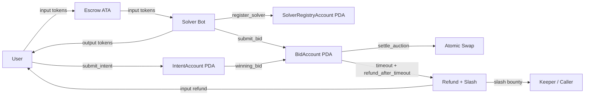

# Flint — On-Chain Intent Auction Protocol

## What is Flint?

Flint is a Solana program for intent-based token swaps. A user submits an intent with locked input tokens and a minimum acceptable output, registered solvers compete during a short auction window, and the winning bid settles atomically so the user receives output tokens while the solver receives the escrowed input tokens in the same on-chain flow.

## Why Solana?

Solana's roughly 400ms slot times make short-lived on-chain auctions practical. Flint uses a 20-slot auction window, which keeps solver competition close to real time while still giving off-chain solvers enough time to detect intents and submit bids.

## Architecture



## Account Structures

| Account | Fields |
| --- | --- |
| `IntentAccount` | `user`, `input_mint`, `output_mint`, `input_amount`, `min_output_amount`, `open_at_slot`, `close_at_slot`, `best_bid_amount`, `winning_bid`, `status`, `nonce`, `bump` |
| `BidAccount` | `solver`, `intent`, `output_amount`, `submitted_at_slot`, `is_settled`, `bump` |
| `SolverRegistryAccount` | `solver`, `stake_amount`, `total_bids`, `total_fills`, `active_winning_bids`, `reputation_score`, `registered_at_slot`, `bump` |
| `ConfigAccount` | `admin`, `slash_authority`, `stake_lockup_slots`, `bump` |

## Instructions

| Instruction | Description | Caller |
| --- | --- | --- |
| `submit_intent` | Locks user input tokens in escrow and opens a 20-slot auction | User |
| `submit_bid` | Places a registered solver bid, updates the current best bid, and tracks active winning exposure | Registered solver |
| `settle_auction` | Settles the winning auction atomically, returns rent, and clears winning exposure | Solver bot / winner |
| `register_solver` | Creates a solver registry PDA and escrows the minimum stake in lamports | Solver |
| `cancel_intent` | Refunds the user after the auction window closes with no bids and returns account rent | User |
| `refund_after_timeout` | Refunds the user after a winning bid is left unfilled past the grace period, slashes solver stake, and returns rent | Keeper / anyone |
| `slash_solver` | Slashes a registered solver after failed fulfillment, gated by `ConfigAccount.slash_authority` | Configured authority |
| `initialize_config` | Creates or reuses the singleton config PDA for admin, slash authority, and lockup settings | Admin |
| `update_slash_authority` | Rotates the slash authority stored in config | Admin |
| `withdraw_stake` | Returns a solver's full stake after lockup when no active winning bids remain | Solver |

## Program ID

- Devnet: pending deployment funding; configured program keypair resolves to `5ZBavnDgcW1wnhKEiGp8KbQSHq4PcdVVosUcEX1m4bFt`
- Localnet: `5ZBavnDgcW1wnhKEiGp8KbQSHq4PcdVVosUcEX1m4bFt`

## Build & Test

```bash
export PATH="/Users/blanco/.cargo/bin:$PATH"
./scripts/build.sh
```

```bash
./scripts/test.sh
```

```bash
cd solver-bot
cargo build
```

## Demo

```bash
node scripts/demo.js happy
```

```bash
node scripts/demo.js timeout
```

```bash
node scripts/benchmark.js
```

## Economic Model

Solver profit is the spread between the external market execution price and the bid submitted on-chain. Users are protected by `min_output_amount`, solvers compete by improving output, and registered solvers post stake that can be slashed on non-fulfillment to make bad execution economically expensive.

For the hackathon flow, timeout recovery is explicit: no-bid intents use `cancel_intent`, while winning-but-unfilled intents use `refund_after_timeout` so escrowed funds do not remain stuck. Terminal paths now return rent by closing escrow and state accounts. The off-chain solver bot now has naive and Jupiter-backed bidding paths, plus explicit settle/refund executor entrypoints.

## Roadmap

- [x] Week 1: Core program (`submit_intent`, `submit_bid`, `settle_auction`)
- [x] Week 2: `register_solver`, `cancel_intent`, `slash_solver`, `refund_after_timeout`, config-based authority, rent-return paths, test coverage
- [ ] Week 2: Devnet funding + deployment
- [x] Week 3: Solver bot executor paths + Jupiter quote strategy skeleton
- [x] Week 4: local benchmark artifact
- [ ] Week 4: benchmark video
