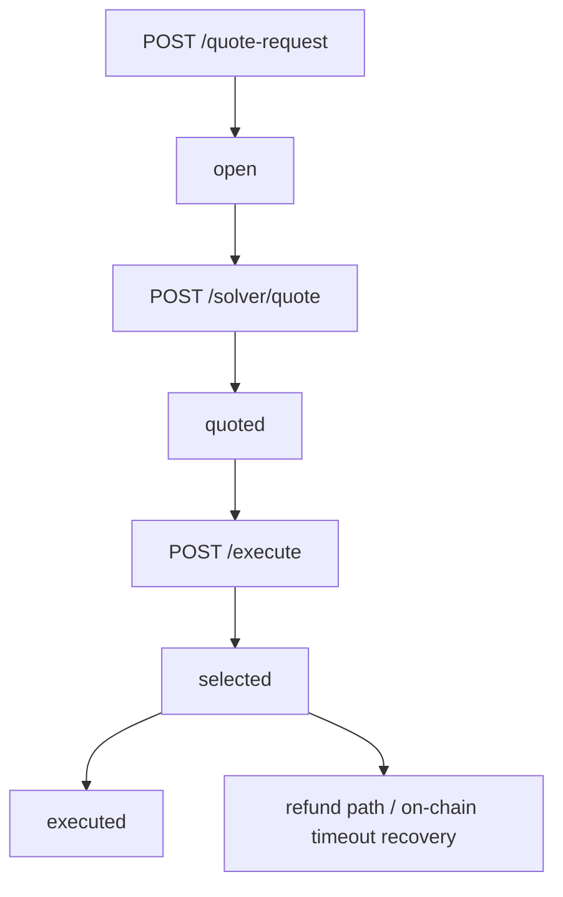

# Flint Relay Request State Diagram

## Meaning of each state

- `open`
  - request created
  - quote deadline active
  - no solver quote accepted yet
- `quoted`
  - at least one solver quote received
  - request still waiting for selection
- `selected`
  - relay chose a winning quote
  - execution plan materialized
- `executed`
  - relay recorded an execution result payload

## On-chain terminal mapping

- `settle_auction`
  - success path
- `refund_after_timeout`
  - timeout recovery path

The relay is an alpha coordination layer. The Flint on-chain kernel remains the authority for escrow, solver accountability, slashing, and timeout recovery.
